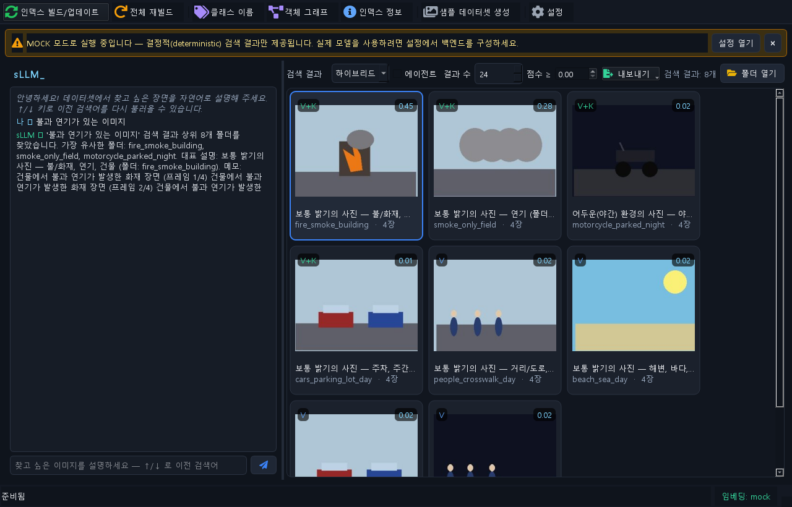
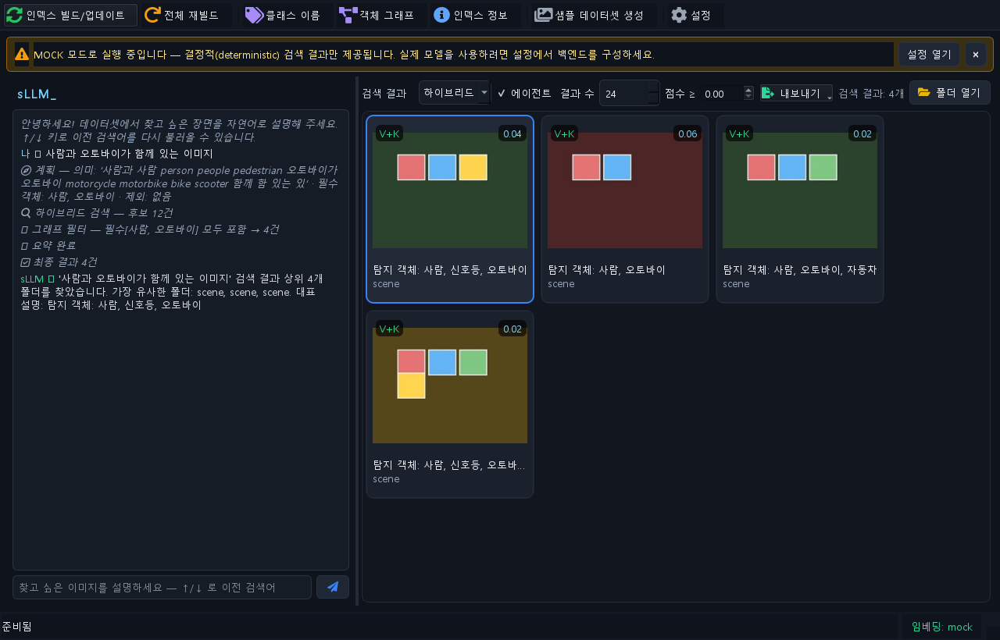
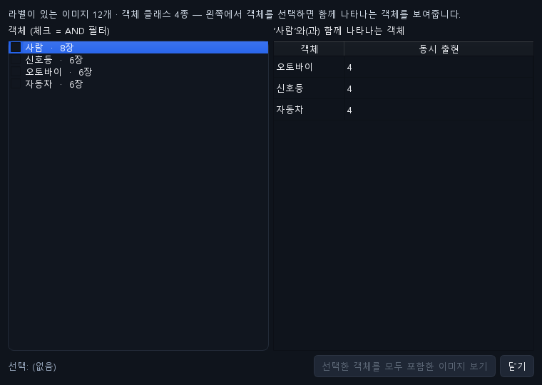
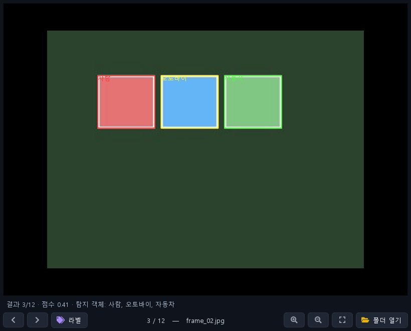

<div align="center">

# 🔎 LLMImageFinder

### Find an image in your folder — just *describe* it in plain language.

Type a sentence like **"a motorcycle parked at night"** or **"fire and smoke"** (Korean or English) and get the matching images back, ranked. A local, **offline-first** desktop app that fuses **multilingual CLIP vector search + BM25 keyword search**, an embedded **object-graph DB**, a **multi-agent** pipeline, and **RAG** summaries — and runs with **zero ML dependencies out of the box**.

<p>
  
  
  
  
  
  
  
  
  
  
</p>



</div>

---

## 😩 The problem

You have thousands of images in nested folders. You remember *what's in one* — "the night shot with the parked motorcycle" — but not **where** it is. File names don't help. Folder browsing is hopeless. And cloud photo search won't touch your local, private, or labeled datasets.

## ✨ The fix

**LLMImageFinder** indexes your images locally and lets you **search by describing them**. It combines *semantic* search (what the image means) with *keyword* search (exact object/label terms), can reason over an **object co-occurrence graph** ("images with **both** a person **and** a motorcycle"), and writes a short grounded summary of the results — all on your machine. No data leaves your computer. With no ML packages installed it still runs end-to-end in a **deterministic mock mode** (great for trying it instantly); flip a switch in Settings to use real models.

---

## 🧭 Do you need…?

| | Feature | What it does |
|---|---|---|
| 🗣️ | **Natural-language search?** | Describe a scene in Korean/English → get ranked matching images (multilingual CLIP, no translation step) |
| 🔀 | **Hybrid retrieval?** | Vector (meaning) **+** BM25 (exact terms) fused by Reciprocal Rank Fusion — switch Vector / Keyword / Hybrid in the header |
| 🕸️ | **Structured object queries?** | An embedded GraphDB answers "images containing **all** of {person, motorcycle}" and "what co-occurs with X" |
| 🤖 | **Agentic search?** | A *plan → hybrid-search → graph-filter → summarize* pipeline, with every step traced in the chat |
| 🧠 | **RAG summaries?** | A small LLM refines your query and writes a grounded Korean summary over the retrieved set |
| 🏷️ | **Labeled (YOLO) datasets?** | Per-image indexing, captions from labels, a class-name editor, and a bounding-box overlay in the viewer |
| 🖼️ | **Fast inspection?** | Thumbnail gallery, zoom/pan viewer, ranked ←/→ navigation, "find similar", CSV/clipboard export |
| 🔌 | **Zero-setup demo?** | Mock-first: the whole app (incl. hybrid/graph/agent) runs deterministically with **no ML deps** |
| 🔒 | **Privacy?** | 100% local. Nothing is written into your dataset folder; nothing leaves your machine |

---

## 🖼️ Screenshots

<div align="center">
  
  
  
  
</div>

> *Screenshots use the built-in mock backend + a generated sample dataset, so they reproduce with `uv run python scripts/make_screenshots.py`.*

---

## 🚀 Quick start (mock mode — no models needed)

Requires [uv](https://docs.astral.sh/uv/) (it auto-installs Python 3.12).

```powershell
uv sync            # base deps: PySide6, chromadb, pillow, numpy, httpx, rank-bm25
uv run imgsearch   # launch (or: uv run python -m imgsearch)
```

The app starts in **mock mode** (a yellow banner says so). Indexing → search → zoom → open-folder all work; results are deterministic. Try the bundled sample data:

```powershell
uv run imgsearch --make-sample .\sample_dataset
```

…or click **샘플 데이터셋 생성** in the toolbar, then type a query like `불과 연기가 있는 이미지` ("images with fire and smoke") in the chat.

## 🧠 Turn on real models

```powershell
uv sync --extra embed   # local CLIP retrieval: torch (CUDA) + sentence-transformers
uv sync --extra graph   # embedded kùzu GraphDB (optional; memory graph is the default)
```

- **Embeddings** — Settings → *Embedding* → backend `jina-clip`, model `jinaai/jina-clip-v2`, device `auto`.
- **Captions + chat (RAG + planner)** — run a [vLLM](https://docs.vllm.ai/) OpenAI-compatible server (WSL2 / Docker / remote) hosting e.g. `Qwen/Qwen2.5-VL-3B-Instruct`, then point Settings → *VLM / Chat* at its base URL. The app falls back to mock and shows the reason if the endpoint is unreachable. Verify it first:

```powershell
uv run python scripts/check_vllm.py --base-url http://localhost:8000/v1 --model Qwen/Qwen2.5-VL-3B-Instruct
```

## 🧩 How it works

```
        describe a scene (KO/EN)
                  │
   ┌──────────────▼───────────────┐     ┌───────────────────────────────┐
   │ planner (rule-based / vLLM)  │ ──▶ │ semantic text + required/      │
   └──────────────┬───────────────┘     │ excluded objects               │
                  │                      └───────────────────────────────┘
   ┌──────────────▼───────────────┐
   │ HYBRID retrieve              │  vector (jina-clip cosine, ChromaDB)
   │   RRF( vector , BM25 )        │  +  keyword (BM25 over captions/labels)
   └──────────────┬───────────────┘
   ┌──────────────▼───────────────┐
   │ GRAPH filter (object graph)  │  keep images containing ALL required objects
   └──────────────┬───────────────┘
   ┌──────────────▼───────────────┐
   │ RAG summarize (vLLM / mock)  │  grounded answer over the retrieved set
   └──────────────┬───────────────┘
        ranked gallery + chat trace
```

Everything above runs **deterministically on mock backends** with zero ML deps; real models (jina-clip, vLLM, kùzu) slot in behind the same interfaces. Full design rationale and a file map: **[`docs/ARCHITECTURE.md`](docs/ARCHITECTURE.md)**.

## 🛠️ Tech stack

| Layer | Choice | Notes |
|---|---|---|
| GUI | **PySide6** + qtawesome | dark theme, non-blocking workers, background model load |
| Vector DB | **ChromaDB** (cosine) | one record per leaf folder or per image |
| Embeddings | **jina-clip-v2** | multilingual CLIP, KO text → image directly; mock = deterministic hash vectors |
| Keyword | **rank-bm25** | BM25 over captions/labels, Korean-aware tokenizer (pure-python, base dep) |
| Fusion | **Reciprocal Rank Fusion** | score stays cosine; fused rank for ordering; provenance badge V / K / V+K |
| Graph DB | **kùzu** (or in-memory) | object co-occurrence; embedded Cypher, serverless; memory backend is the default |
| LLM / VLM | **vLLM** (OpenAI-compatible) | Qwen2.5-VL for captions, query-refine, RAG summary, and the agent's JSON plan |

## 🧪 Tests

```powershell
uv run --extra dev pytest                 # 84 tests, mock backends, no models needed
uv run --extra dev --extra graph pytest   # + kùzu GraphDB parity tests
uv run python scripts/ui_smoke.py         # offscreen GUI smoke
```

## 📚 Docs

- 📐 **Architecture & design philosophy** (RAG · VectorDB · Hybrid · GraphDB · multi-agent · vLLM): [`docs/ARCHITECTURE.md`](docs/ARCHITECTURE.md)
- 🇰🇷 **한국어 상세 사용 설명서**: [`README.ko.md`](README.ko.md)
- 📝 **Changelog**: [`CHANGELOG.md`](CHANGELOG.md)

The source code is heavily commented (in Korean) throughout.

## 📄 License

[MIT](LICENSE).

<div align="center">
<sub>Local-first · privacy-respecting · mock-first. Built for searching real, labeled image datasets by describing them.</sub>
</div>
